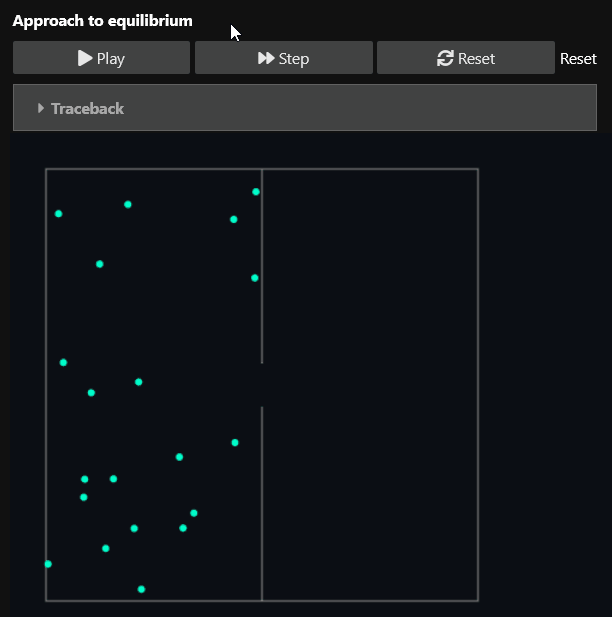
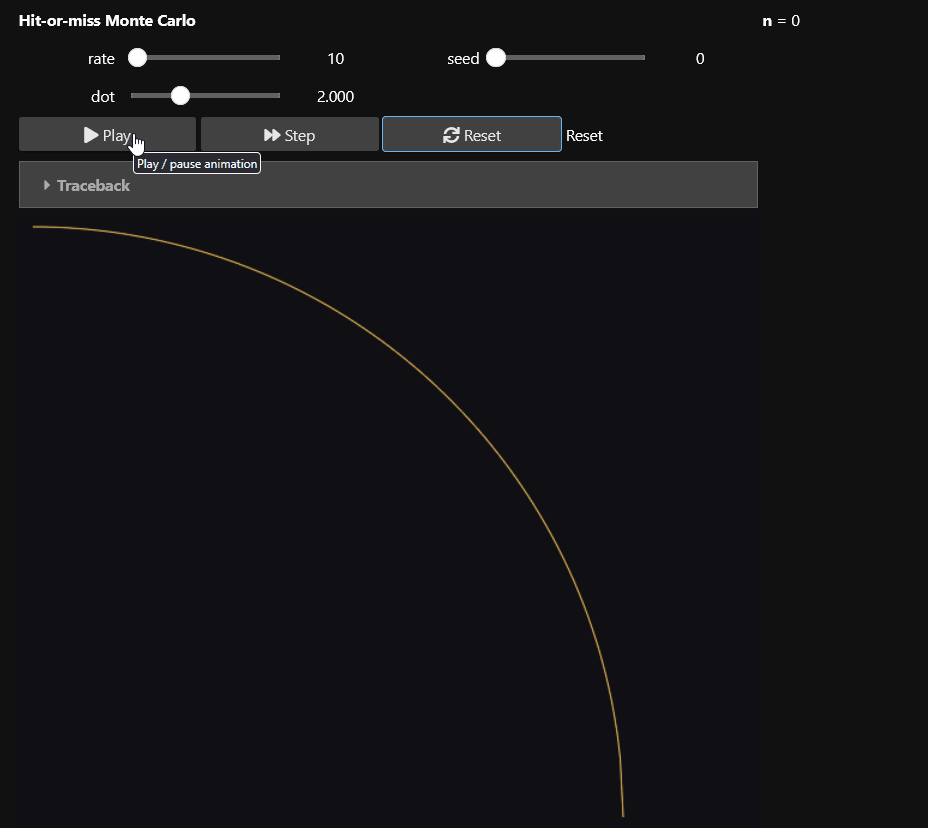

# 2D animation examples

## Approach to equilibrium

Demonstrates how a system where an atom has a 50/50 chance of appearing on either side of
a box approaches equilibrium.

This example separates simulation state from drawing. The player calls `on_update()` and
then `on_draw()` for each frame.



```python
import numpy as np
import ipywidgets as widgets
from IPython.display import display
from ipycanvas import hold_canvas
from matterlib import anim2d


class EquilibriumSim:
    def __init__(self, n: int, seed: int = 12345) -> None:
        self.rng = np.random.default_rng(seed)
        self.n = n
        self.pos = self._initial_positions()

    def _initial_positions(self) -> np.ndarray:
        return np.column_stack(
            [0.5 * self.rng.random(self.n), self.rng.random(self.n)]
        )

    def reset(self) -> None:
        self.pos = self._initial_positions()

    def step(self) -> None:
        i = int(self.rng.integers(self.n))
        if self.pos[i, 0] < 0.5:
            self.pos[i, 0] = 0.5 + 0.5 * self.rng.random()
        else:
            self.pos[i, 0] = 0.5 * self.rng.random()
        self.pos[i, 1] = self.rng.random()


class EquilibriumAnimator(anim2d.Canvas2DAnimator):
    def __init__(self, n: int = 10) -> None:
        self.sim = EquilibriumSim(n)

    def on_start(self, canvas) -> None:
        self.canvas = canvas
        self.pad = 30
        self.scale = min(canvas.width - 2 * self.pad, canvas.height - 2 * self.pad)

    def to_canvas(self, x: float, y: float) -> tuple[float, float]:
        return self.pad + x * self.scale, self.canvas.height - self.pad - y * self.scale

    def on_reset(self) -> None:
        self.sim.reset()

    def on_update(self, dt: float) -> None:
        self.sim.step()

    def on_draw(self) -> None:
        c = self.canvas
        with hold_canvas(c):
            c.fill_style = "#0b0e14"
            c.fill_rect(0, 0, c.width, c.height)
            c.stroke_style = "#888888"
            c.stroke_rect(*self.to_canvas(0, 1), self.scale, self.scale)
            c.begin_path()
            c.move_to(*self.to_canvas(0.5, 0))
            c.line_to(*self.to_canvas(0.5, 0.45))
            c.move_to(*self.to_canvas(0.5, 0.55))
            c.line_to(*self.to_canvas(0.5, 1))
            c.stroke()
            c.fill_style = "#00ffcc"
            for x, y in self.sim.pos:
                c.fill_circle(*self.to_canvas(x, y), 3)


anim = EquilibriumAnimator(n=20)
player = anim2d.Canvas2DPlayer(
    animator=anim,
    width=520,
    height=420,
    target_fps=30,
    dt=1 / 60,
    title="Approach to equilibrium",
)
player.canvas.layout = widgets.Layout(
    width="520px",
    height="420px",
    flex="0 0 auto",
)

display(
    widgets.VBox(
        [player.ui, player.canvas],
        layout=widgets.Layout(align_items="flex-start"),
    )
)
```

## Monte Carlo approximation of pi



This hit-or-miss calculation estimates \(\pi\). `ParamSpec` creates controls, while
the animator accumulates new points without redrawing the entire canvas.

```python
import numpy as np
import ipywidgets as widgets
from IPython.display import display
from ipycanvas import hold_canvas
from matterlib import anim2d


class HitOrMissAnimator(anim2d.Canvas2DAnimator):
    PARAMS = {
        "points_per_frame": anim2d.ParamSpec(
            "int_slider",
            default=10,
            min=1,
            max=200,
            step=1,
            description="rate",
            on_change="none",
        ),
        "seed": anim2d.ParamSpec(
            "int_slider",
            default=0,
            min=0,
            max=9999,
            step=1,
            description="seed",
            on_change="reset",
        ),
        "dot_size": anim2d.ParamSpec(
            "float_slider",
            default=2.0,
            min=0.5,
            max=5.0,
            step=0.1,
            description="dot",
            on_change="none",
        ),
    }

    def __init__(self) -> None:
        self.stats = widgets.HTML()

    def on_start(self, canvas) -> None:
        self.canvas = canvas
        self.pad = 14
        self.scale = min(canvas.width - 2 * self.pad, canvas.height - 2 * self.pad)
        self.on_reset()

    def to_canvas(self, x: float, y: float) -> tuple[float, float]:
        return self.pad + x * self.scale, self.canvas.height - self.pad - y * self.scale

    def on_reset(self) -> None:
        self.rng = np.random.default_rng(int(getattr(self, "seed", 0)))
        self.n = self.hits = 0
        self.pending = []
        self.background_drawn = False
        self.stats.value = "<b>n</b> = 0"

    def on_update(self, dt: float) -> None:
        count = int(getattr(self, "points_per_frame", 10))
        xs = self.rng.random(count)
        ys = self.rng.random(count)
        hit = xs**2 + ys**2 <= 1
        self.n += count
        self.hits += int(hit.sum())
        self.pending.extend(zip(xs.tolist(), ys.tolist(), hit.tolist()))
        estimate = 4 * self.hits / self.n
        self.stats.value = f"<b>n</b> = {self.n} &nbsp; <b>π</b> ≈ {estimate:.5f}"

    def on_draw(self) -> None:
        c = self.canvas
        with hold_canvas(c):
            if not self.background_drawn:
                c.fill_style = "#101014"
                c.fill_rect(0, 0, c.width, c.height)
                c.stroke_style = "#ffcc55"
                xs = np.linspace(0, 1, 200)
                ys = np.sqrt(1 - xs**2)
                c.begin_path()
                c.move_to(*self.to_canvas(float(xs[0]), float(ys[0])))
                for x, y in zip(xs[1:], ys[1:]):
                    c.line_to(*self.to_canvas(float(x), float(y)))
                c.stroke()
                self.background_drawn = True
            radius = float(getattr(self, "dot_size", 2.0))
            for x, y, is_hit in self.pending:
                c.fill_style = "#55ff88" if is_hit else "#666666"
                c.fill_circle(*self.to_canvas(x, y), radius)
            self.pending.clear()


anim = HitOrMissAnimator()
player = anim2d.Canvas2DPlayer(
    animator=anim,
    width=620,
    height=520,
    target_fps=60,
    dt=1 / 60,
    title="Hit-or-miss Monte Carlo",
)
display(widgets.HBox([widgets.VBox([player.ui, player.canvas]), anim.stats]))
```
