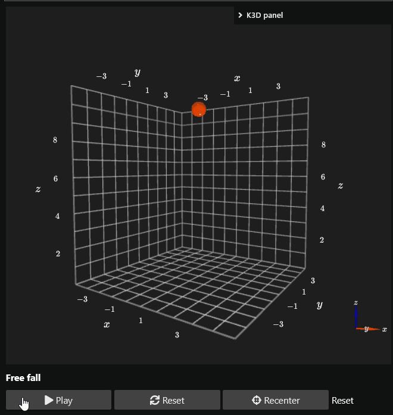

# 3D animation examples

These examples demonstrate the three playback models: realtime, precomputed,
and chunked.

## Stateful free fall

Simulate freefall of a particle.



A `K3DAnimator` advances the simulation using wall-clock time and updates the k3d object directly.

```python
import k3d
from matterlib import anim3d

G = 9.81


class FreeFall(anim3d.K3DAnimator):
    def __init__(self, plot, y0: float, v0: float) -> None:
        self.initial = (y0, v0)
        self.y, self.v = self.initial
        self.ball = k3d.points(
            positions=[[0, 0, self.y]],
            point_size=0.9,
            color=0xFF5500,
        )
        plot += self.ball

    def on_start(self, plot) -> None:
        return

    def on_update(self, dt: float) -> None:
        self.v -= G * dt
        self.y += self.v * dt
        self.ball.positions = [[0, 0, self.y]]

    def on_reset(self) -> None:
        self.y, self.v = self.initial
        self.ball.positions = [[0, 0, self.y]]


y0 = 10.0
plot = anim3d.make_dark_plot(height=500)
plot.display()
player = anim3d.make_stateful_player(
    plot=plot,
    animator=FreeFall(plot, y0=y0, v0=0.0),
    target_fps=60,
    camera_bounds=(-5, -5, 0, 5, 5, y0 + 1),
    title="Free fall",
)
player.ui
```

## Precomputed frames

Here every frame is calculated up front. `FrameBinding` maps each frame array
to the corresponding k3d trait.

```python
import numpy as np
import k3d
from matterlib import anim3d


def rotation_z(angle: float) -> np.ndarray:
    c, s = np.cos(angle), np.sin(angle)
    return np.array(
        [[c, -s, 0], [s, c, 0], [0, 0, 1]],
        dtype=np.float32,
    )


def thin_box():
    vertices = np.array(
        [
            [-0.8, -0.3, -0.05], [0.8, -0.3, -0.05],
            [0.8, 0.3, -0.05], [-0.8, 0.3, -0.05],
            [-0.8, -0.3, 0.05], [0.8, -0.3, 0.05],
            [0.8, 0.3, 0.05], [-0.8, 0.3, 0.05],
        ],
        dtype=np.float32,
    )
    indices = np.array(
        [
            [0, 1, 2], [0, 2, 3], [4, 6, 5], [4, 7, 6],
            [0, 4, 5], [0, 5, 1], [1, 5, 6], [1, 6, 2],
            [2, 6, 7], [2, 7, 3], [3, 7, 4], [3, 4, 0],
        ],
        dtype=np.uint32,
    )
    return k3d.mesh(
        vertices=vertices,
        indices=indices,
        color=0xFFAA00,
        opacity=0.8,
    )


nframes, dt, omega = 120, 1 / 60, np.pi / 4
model_matrices = np.empty((nframes, 4, 4), dtype=np.float32)
axis_vectors = np.empty((nframes, 1, 3), dtype=np.float32)

for i, angle in enumerate(omega * np.arange(nframes) * dt):
    rotation = rotation_z(angle)
    matrix = np.eye(4, dtype=np.float32)
    matrix[:3, :3] = rotation
    model_matrices[i] = matrix
    axis_vectors[i, 0] = rotation @ np.array([1.2, 0, 0], dtype=np.float32)

frames = {
    "model_matrices": model_matrices,
    "axis_vectors": axis_vectors,
}

plot = anim3d.make_dark_plot(height=500)
body = thin_box()
axis = k3d.vectors(
    origins=np.zeros((1, 3), dtype=np.float32),
    vectors=axis_vectors[0],
    color=0xFF55FF,
)
plot += body
plot += axis
plot.display()

bindings = [
    anim3d.FrameBinding("model_matrices", body, "model_matrix"),
    anim3d.FrameBinding("axis_vectors", axis, "vectors"),
]
player = anim3d.make_player(
    plot=plot,
    frames=frames,
    bindings=bindings,
    dt=dt,
    camera_bounds=(-2, -2, -1.5, 2, 2, 1.5),
    title="Rigid body (precomputed)",
    loop=True,
)
player.ui
```

Each value in `frames` has a leading frame dimension. Indexing one frame from
`model_matrices` produces a `(4, 4)` matrix, while indexing `axis_vectors`
produces the `(1, 3)` array expected by `k3d.vectors`.

## Chunked simulation

A `ChunkedAnimator` advances state with `step()` and returns renderable values
from `snapshot()`. The player prepares frames in a background buffer, which is
useful when simulating the entire trajectory up front would be expensive.

```python
import numpy as np
import k3d
from matterlib import anim3d


def rotation_z(angle: float) -> np.ndarray:
    c, s = np.cos(angle), np.sin(angle)
    return np.array(
        [[c, -s, 0], [s, c, 0], [0, 0, 1]],
        dtype=np.float32,
    )


def thin_box():
    vertices = np.array(
        [
            [-0.8, -0.3, -0.05], [0.8, -0.3, -0.05],
            [0.8, 0.3, -0.05], [-0.8, 0.3, -0.05],
            [-0.8, -0.3, 0.05], [0.8, -0.3, 0.05],
            [0.8, 0.3, 0.05], [-0.8, 0.3, 0.05],
        ],
        dtype=np.float32,
    )
    indices = np.array(
        [
            [0, 1, 2], [0, 2, 3], [4, 6, 5], [4, 7, 6],
            [0, 4, 5], [0, 5, 1], [1, 5, 6], [1, 6, 2],
            [2, 6, 7], [2, 7, 3], [3, 7, 4], [3, 4, 0],
        ],
        dtype=np.uint32,
    )
    return k3d.mesh(
        vertices=vertices,
        indices=indices,
        color=0xFFAA00,
        opacity=0.8,
    )


class RotatingBody(anim3d.ChunkedAnimator):
    def __init__(self, plot, omega: float = np.pi / 4) -> None:
        self.omega = omega
        self.angle = 0.0
        self.body = thin_box()
        self.axis = k3d.vectors(
            origins=np.zeros((1, 3), dtype=np.float32),
            vectors=np.array([[1.2, 0, 0]], dtype=np.float32),
            color=0xFF55FF,
        )
        plot += self.body
        plot += self.axis

    def on_start(self, plot) -> None:
        return

    def on_reset(self) -> None:
        self.angle = 0.0

    def step(self, dt: float) -> None:
        self.angle += self.omega * dt

    def snapshot(self) -> dict:
        rotation = rotation_z(self.angle)
        matrix = np.eye(4, dtype=np.float32)
        matrix[:3, :3] = rotation
        vector = rotation @ np.array([1.2, 0, 0], dtype=np.float32)
        return {
            "model_matrix": matrix,
            "axis_vector": np.array([vector], dtype=np.float32),
        }


plot = anim3d.make_dark_plot(height=500)
animator = RotatingBody(plot)
bindings = [
    anim3d.FrameBinding("model_matrix", animator.body, "model_matrix"),
    anim3d.FrameBinding("axis_vector", animator.axis, "vectors"),
]
plot.display()
player = anim3d.make_chunked_player(
    plot=plot,
    animator=animator,
    bindings=bindings,
    dt=1 / 120,
    target_fps=60,
    chunk_seconds=2.0,
    buffer_chunks=2,
    camera_bounds=(-2, -2, -1.5, 2, 2, 1.5),
    title="Rigid body (chunked)",
)
player.ui
```

Every `FrameBinding.key` must be present in each snapshot. Snapshot values are
single-frame values; the player stacks them into frame arrays internally.
